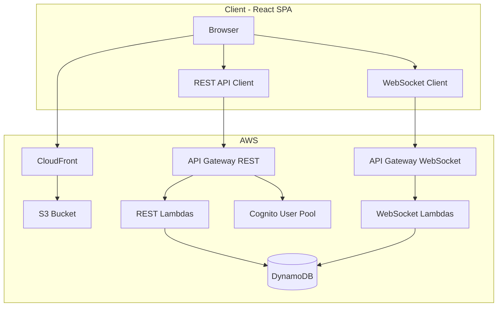

# Spidey Social — Architecture & Developer Guide

A comprehensive guide to what Spidey Social is, which AWS technologies power it, why each was chosen, and how the system works end-to-end.

---

## 1. Product Overview

**Spidey Social** is a location-based ephemeral social app — "Your Friendly Neighborhood Network."

| Feature | Description |
|---------|-------------|
| **Posts (webs)** | Users create short posts (max 280 chars) with location and visibility radius (0.5–10 mi). Posts expire after TTL (30–120 min). |
| **Feed** | Browse posts within a configurable radius near you. Own posts and swung posts are excluded. |
| **Sense (radar)** | Visual radar showing post direction and distance on a circular map. |
| **Swing-in** | One swing per post per user. Swinging in creates a chat with the post owner and removes the post from your Feed/Sense. |
| **Chat** | Messaging with post owners after swing-in. One chat per swung post. |
| **Real-time** | WebSocket push for new posts (Feed) and new messages (Chat) — no polling required. |
| **Profile** | My posts, sign-out. |

---

## 2. AWS Technologies Used

| AWS Service | Purpose | Why |
|-------------|---------|-----|
| **Amazon S3** | Host static React app (HTML, JS, CSS) | Simple, cheap, scales for static assets. Website hosting with SPA fallback. |
| **Amazon CloudFront** | HTTPS CDN in front of S3 | HTTPS required for browser Geolocation API; fast global delivery; cache invalidation for deploys. |
| **Amazon Cognito** | User auth (sign-up, sign-in, JWT) | Managed auth; no custom user DB; JWT for API and WebSocket auth. |
| **Amazon API Gateway (REST)** | HTTP API for CRUD operations | Lambda integration; CORS; Cognito authorizer for protected routes. |
| **Amazon API Gateway (WebSocket)** | Real-time bidirectional channel | Push new posts and messages without polling; persistent connections. |
| **AWS Lambda** | Backend logic (create post, list, swing-in, chat, connect/disconnect) | Serverless; pay per request; no server management; auto-scaling. |
| **Amazon DynamoDB** | Single-table data store (webs, swings, chats, connections) | Serverless; pay per request; flexible schema; GSIs for efficient queries. |
| **AWS CDK** | Infrastructure as Code for all resources | TypeScript; constructs; drift prevention; CloudFormation under the hood. |

---

## 3. System Architecture



**Request flow:**
- **Static assets:** Browser → CloudFront → S3
- **REST API:** Browser → API Gateway REST → Lambda → DynamoDB; Cognito validates JWT
- **WebSocket:** Browser → API Gateway WebSocket → ws-connect / ws-disconnect Lambdas; Lambdas push to clients via `ApiGatewayManagementApi.postToConnection`

---

## 4. DynamoDB Data Model

**Table:** `SpideySocialMvp`  
**Keys:** `pk` (partition), `sk` (sort), `ttlEpoch` (optional TTL for auto-deletion)

| Entity | pk | sk | Purpose |
|--------|-----|-----|---------|
| Web (post) | `WEB#webId` | `META` | Post metadata. Has `gsi1pk=WEB`, `gsi2pk=USER#ownerId` for queries. |
| Swing-in | `WEB#webId` | `SWINGIN#userId` | User swung into post. `gsi2pk=USER#swingerId` for "my chats" list. |
| Chat message | `CHAT#webId` | `MSG#timestamp` | Message in chat thread. |
| WebSocket connection | `WS#CONNECTION` | connectionId | All live connections (for broadcast). |
| WebSocket user | `WS#USER#userId` | connectionId | Connections per user (for targeted push). |

**Global Secondary Indexes:**
- **gsi1** (`gsi1pk`, `gsi1sk`) — List all webs by recency (Feed)
- **gsi2** (`gsi2pk`, `gsi2sk`) — List by user: my webs, my swings

---

## 5. API Reference

### REST API

Base URL: `https://<api-id>.execute-api.<region>.amazonaws.com/prod`

| Method | Path | Auth | Purpose |
|--------|------|------|---------|
| GET | `/webs?lat=&lng=&radius=` | No | List webs near location. Filters by radius and visibility. |
| POST | `/webs` | Cognito | Create web (post). Body: `{ content, category, ttl, lat?, lng?, visibilityRadius? }` |
| POST | `/webs/{webId}/swing-in` | Cognito | Swing in. Body: `{ lat?, lng? }`. Returns `{ isNew }`. |
| GET | `/users/me/webs` | Cognito | My posts. |
| GET | `/users/me/swings` | Cognito | My chats (swung posts). |
| GET | `/chats/{webId}/messages` | Cognito | List messages in chat. |
| POST | `/chats/{webId}/messages` | Cognito | Send message. Body: `{ content }`. |

### WebSocket API

| Route | Purpose |
|-------|---------|
| `$connect` | Client connects with `?token=<jwt>`. ws-connect validates JWT, stores connection in DynamoDB. |
| `$disconnect` | ws-disconnect removes connection from DynamoDB. |
| Push events | Lambdas call `ApiGatewayManagementApi.postToConnection` to send: `web_added`, `message_new`, `swing_in` |

---

## 6. Key User Flows

### Create post

1. User submits post in Post tab; frontend calls `POST /webs` with content, coords, radius, ttl.
2. create-web Lambda writes `WEB#webId` + `META` to DynamoDB.
3. Lambda fans out `web_added` to all WebSocket connections (create-web has `execute-api:ManageConnections`).
4. Clients with Feed open receive event; they filter by radius and append new post if applicable.

### Swing-in

1. User taps "Swing in" on a post; frontend calls `POST /webs/{webId}/swing-in` with coords.
2. swing-in Lambda writes `SWINGIN#userId` record, increments `joinedCount` on web META.
3. Lambda pushes `swing_in` to post owner via `WS#USER#webOwnerId` connections.
4. Swinger navigates to Chat; chat appears in list (from list-my-swings).

### Send message

1. User sends message; frontend calls `POST /chats/{webId}/messages` with content.
2. send-message Lambda writes `CHAT#webId` + `MSG#timestamp` to DynamoDB.
3. Lambda pushes `message_new` to other participants (web owner + swingers except sender).
4. Chat UI appends message in real time via WebSocket subscription.

---

## 7. File Structure

| Path | Purpose |
|------|---------|
| [infrastructure/lib/spidey-social-mvp-stack.ts](../infrastructure/lib/spidey-social-mvp-stack.ts) | CDK stack — defines all AWS resources |
| [infrastructure/lambdas/](../infrastructure/lambdas/) | Lambda handlers: create-web, list-webs, list-my-webs, list-my-swings, swing-in, send-message, list-messages, ws-connect, ws-disconnect |
| [frontend/api/webs.ts](../frontend/api/webs.ts) | REST API client — all HTTP calls |
| [frontend/lib/WebSocketContext.tsx](../frontend/lib/WebSocketContext.tsx) | WebSocket connect, subscribe, handle events |
| [frontend/lib/auth.ts](../frontend/lib/auth.ts) | Cognito auth (Amplify) |
| [frontend/lib/geolocation.ts](../frontend/lib/geolocation.ts) | Browser Geolocation API wrapper |
| [docs/AWS_SETUP.md](AWS_SETUP.md) | Prerequisites: AWS account, IAM, CLI, CDK bootstrap |
| [docs/MVP_DEPLOY.md](MVP_DEPLOY.md) | Legacy minimal deploy (S3 + DynamoDB only) |

---

## 8. Deployment Guide

### Prerequisites

- AWS CLI configured (`aws configure`)
- CDK bootstrapped: `cd infrastructure && npx cdk bootstrap`

See [docs/AWS_SETUP.md](AWS_SETUP.md) for full setup.

### Deploy infrastructure

```bash
cd infrastructure
npm install
npx cdk deploy --require-approval never
```

Note the stack outputs: `UserPoolId`, `UserPoolClientId`, `TableName`, `WebBucketName`, `CloudFrontDistributionId`, `RestApiUrl`, `WebSocketUrl`, `WebsiteUrl`.

### Deploy frontend

```bash
cd frontend
./scripts/deploy.sh
```

The deploy script:
1. Fetches stack outputs from CloudFormation
2. Builds the app with `VITE_API_URL`, `VITE_WS_URL`, `VITE_COGNITO_USER_POOL_ID`, `VITE_COGNITO_CLIENT_ID`
3. Syncs `dist/` to S3
4. Invalidates CloudFront cache

### Local development

```bash
cd frontend
npm run dev
```

Create `frontend/.env.local` with the stack output values so the dev server can reach the deployed API and WebSocket.

---

## 9. Operational Metrics Dashboard

A **CloudWatch Dashboard** (`SpideySocialMvp-Ops`) is deployed with the stack and shows:

| Widget | Metrics |
|--------|---------|
| **Lambda Invocations** | Total invocations per Lambda (create-web, list-webs, swing-in, etc.) |
| **Lambda Duration (Latency)** | Average execution time (ms) per Lambda |
| **Lambda Errors** | Error count per Lambda |
| **Lambda Concurrent Executions** | Number of functions running simultaneously |
| **REST API — Request Count** | Total HTTP requests to the REST API |
| **REST API — Latency** | API Gateway response time (ms) |
| **REST API — 4xx / 5xx Errors** | Client and server error counts |
| **DynamoDB — Consumed Capacity** | Read and write capacity units consumed |

**Access:** After deploy, use the `OpsDashboardUrl` stack output, or in AWS Console: **CloudWatch → Dashboards → SpideySocialMvp-Ops**.

No extra configuration is required — Lambda, API Gateway, and DynamoDB publish these metrics automatically to CloudWatch. The dashboard uses a 3-hour default time range; you can adjust it in the CloudWatch console.

**Optional:** For deeper Lambda insights (memory utilization, init duration), enable [Lambda Insights](https://docs.aws.amazon.com/lambda/latest/dg/monitoring-insights.html) on your functions.

---

## 10. Tech Stack Summary

| Layer | Technology |
|-------|------------|
| Frontend | React, Vite, TypeScript, Tailwind CSS, AWS Amplify (auth) |
| Hosting | S3 + CloudFront |
| Auth | Amazon Cognito |
| API | API Gateway (REST + WebSocket) |
| Backend | AWS Lambda (Node.js 20) |
| Database | Amazon DynamoDB |
| IaC | AWS CDK (TypeScript) |
